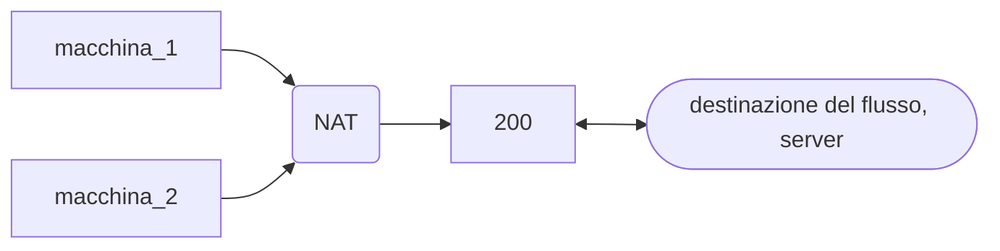
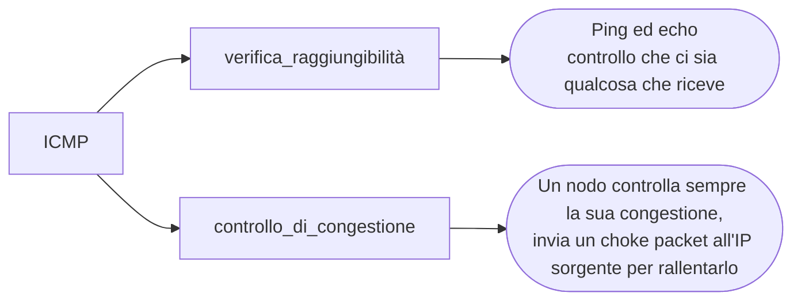
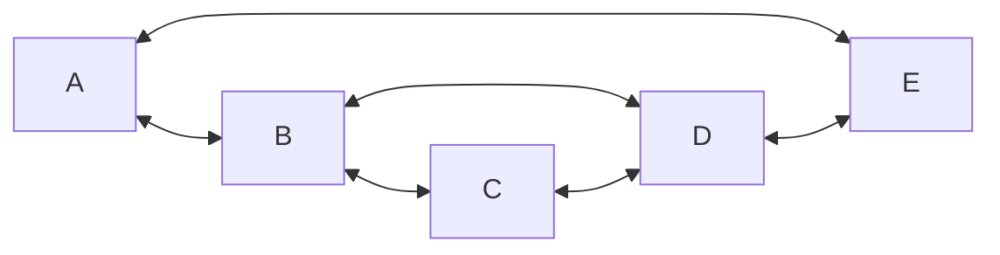
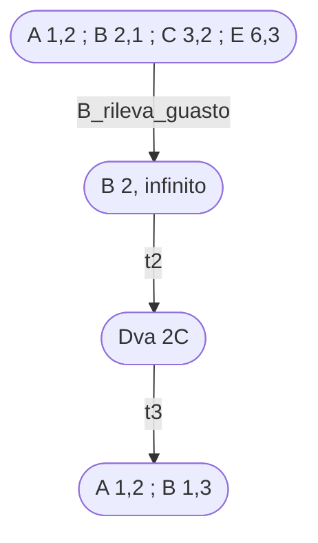
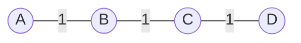
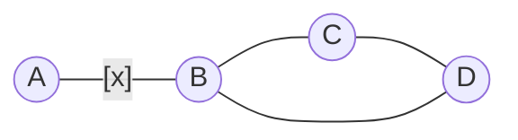
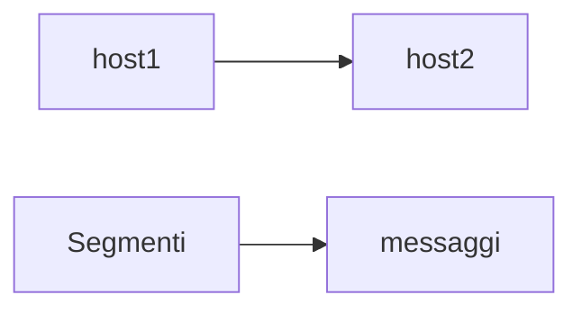
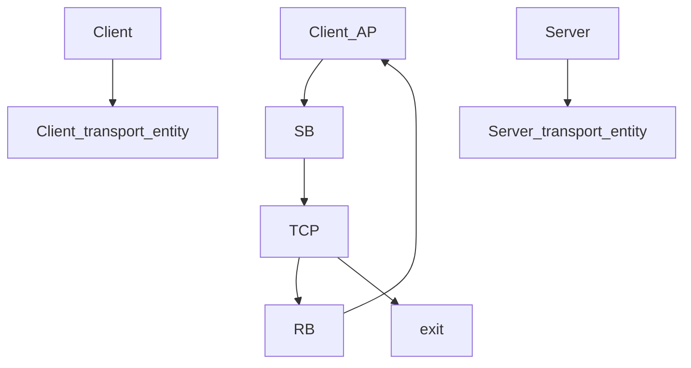

 
# Reti di calcolatori

Requisiti rete:

- prestazioni
- affidabilità, attraverso TCP → pezzo di software più diffuso sul pianeta
- sicurezza
- indirizzamento, protocollo Ip
- instradamento (routing)

Le regole necessarie non sono necessariamente delegate alla rete, una parte sono della rete una parte mia.

messaggio: coda input —> router (viene analizzato) —> output

L’unica parte software è la popolazione ella tabella, il resto viene svolto via hardware.

Frammento in pacchetti (unità dati di dimensione massima fissata) l’unità dati dell’utente che viene poi riassemblata.

L' **Instradamento** è la capacità di un nodo di trovare la strada verso un altro nodo
L'affidabilità deve garantire:
- completezza, devono arrivare tutti i frame.
- ordine, i frammenti devono arrivare in ordine.
- non duplicità, non devo avere copie.

### Routing
 
Trovare la migliore strada per arrivare a destinazione in un certo istante di tempo

Tabella sulla quale si basa il processo di routing.

Una grande unità dati viene frammentata in tanti pacchetti quanti ne servono per poter far passare tutta l’unità senza incorrere in un overflow.

origine: frammento → destinazione assemblo
Tra frammento singolo e file si perde, per questo il tempo e la possibilità di arrivo dei pacchetti può variare.

## Commutazione

- Commutazione di un messaggio
- Commutazione di un pacchetto

Con commutazione si intende la scelta di un percorso per spedire un messaggio da un mittente ad un destinatario.

I dati da trasmettere vengono decorati con:

- un’intestazione iniziale (che identifica mittente e destinatario, header)
- una coda che funge da codice rilevatore di errore
- possibili altre informazioni tipo il protocollo usato

La commutazione si definisce con affidabilità ed efficienza:

- efficienza: basata soprattutto sul **Packet error rate $p_{er} = 1-(1-b_{er})^{n} = n•b_{er}$**

## Internet

tutte le reti del pianeta connesse ad internet sfruttano l’**IP** Internet Protocol.

Ogni rete appartenente all’internet usa tecniche diverse di instradamento e usa o può usare tecniche diverse per fare routing.

Le reti a virtual circuit (circuito virtuale) sono reti affidabili poiché mantengono il traffico su un unico percorso

La validazione di avvenuta ricezione avviene attraverso l’**ACK (acknowledgment)**
Grazie a questo posso anche decidere un tempo t utile.

**Jitter:** varianza sul ritardo in rete

Per calcolare la velocità del traffico su rete useremo:

$$ T = t_{x}+2t_{p} $$
Dove tx è il tempo di trasmissione, $t_{p}$ tempo di propagazione.
$$t_x = \frac{l}{ck} $$
Dove $l=lunghezza\space frame$ e $c=velocità\space della \space luce$
$$t_p=\frac{l_{cavo}}{c}$$
Ovviamente T non è esattamente uguale al valore dato ma leggermente più grande.
Il tempo di trasmissione funzione della velocità della trasmissione, quindi alla velocità del clock, è uguale alla dimensione del pacchetto/il bitrate dello stesso.

Il tempo di propagazione invece è dato dal rapporto tra distanza e velocità del canale

## Host

l’host è una macchina che ospita i processi comunicanti su rete, possiamo avere host sorgente e host destinazione.

### Protocollo

L’implementazione di uno specifico protocollo gestisce le regole in base alle quali due macchine comunicano all’interno di una rete. è diviso in diversi livelli, il livello di base è quello **fisico** (ovvero un cavo o fibra ottica) che permette la connessione tra macchine, il livello due è il **Data Link** un livello che contiene tutte le regole per operare su un singolo link; il terzo livello è il **Network** permette l’instradamento conoscendo la topologia della rete magliata, la non conoscenza o la conoscenza parziale porterebbe ad altri risultati.

Sono presenti inoltre altri livelli ovvero il **trasporto**, la **sessione**(deprecato), la **presentazione**(deprecato) e l’**applicazione**.

Al livello 4 è messa l’affidabilità, questo è reso possibile grazie a tcp e udp, la prima si occupa della comunicazione affidabile mentre alla seconda non importa nulla del canale affidabile.

### Livelli ISO/OSI

**Datalink**

Si occupa del collegamento tra due nodi, il payload viene “incapsulato” tra un header(stx) e una tail(ETX) (formati da bit), questa capsula è detta frame.

Possiamo utilizzare il bit stuffing, questo garantisce che all’interno del payload non ci sia una sequenza uguale alla tail. Si occupa infatti di inserire un bit nei dati in modo da renderlo diverso sia da header che da tail, semplicemente si controlla quanti 1 consecutivi sono presenti in header e tail, nei dati appena trova una sequenza di 1 lunga n-1 va ad inserire uno 0 per renderla diversa.

### `Broadcast(AI)`

Il broadcast è un metodo di trasmissione dati in cui un nodo invia un messaggio a tutti gli altri nodi della rete contemporaneamente. Questo tipo di comunicazione è particolarmente utile quando si deve inviare la stessa informazione a tutti i dispositivi connessi.

Caratteristiche principali del broadcast:

- Efficienza nella distribuzione di informazioni a larga scala
- Utilizzo in protocolli di rete come ARP (Address Resolution Protocol)
- Potenziale sovraccarico della rete se usato eccessivamente
- Limitato generalmente al dominio di broadcast locale per evitare congestioni

Il broadcast è ampiamente utilizzato nelle reti locali (LAN) ma è generalmente limitato o evitato nelle reti più ampie come Internet per ragioni di efficienza e sicurezza.

## `CSMA/CD(AI)`

CSMA/CD (Carrier Sense Multiple Access with Collision Detection) è un protocollo di accesso al mezzo utilizzato nelle reti Ethernet per gestire l'accesso condiviso al canale di comunicazione. Ecco i punti chiave:

- `Carrier Sense`: i dispositivi ascoltano il canale prima di trasmettere, finché non trovano il canale libero non trasmettono
- `Multiple Access`: più dispositivi possono accedere allo stesso mezzo di trasmissione
- `Collision Detection`: i dispositivi sono in grado di rilevare le collisioni durante la trasmissione

Funzionamento:

- Se il canale è libero, il dispositivo inizia a trasmettere
- Se si rileva una collisione, la trasmissione viene interrotta
- Dopo una collisione, i dispositivi attendono un tempo casuale prima di ritentare

CSMA/CD è fondamentale per l'efficienza delle reti Ethernet, permettendo l'utilizzo ottimale del mezzo condiviso e riducendo le probabilità di collisioni ripetute.

L’intervallo di tempo randomico per trasmettere è determinato dall’algoritmo BEB (Binary Exponential back-off)

64 B è la dimensione minima di una frame ethernet

## Domini di collisione
Possiamo utilizzarli al posto dei semplici cavi, e presentano i seguenti componenti:
- ### `Hub`
	è un dispositivo di livello 1 passivo.
	un hub è un centro stella passivo (non presenta `Carrier Sense` o ` Collision Detection`) di livello fisico che riceve e ritrasmette il segnale; va a modellare il comportamento del **BUS** ed è realizzabile su più livelli. La frame entra nell'hub che la propaga ai client i quali rispondono con una frame a loro volta. 
	Sull'hub dobbiamo contare come lunghezza sia l'invio che il ritorno della frame.

- ### `Bridge`
	è un dispositivo classificato a livello 2 (opera a livello `Mac`) e opera attraverso `forwarding`, andando a separare i domini di collisione a cui è collegato.
	il livello 2 locale è molto simile a quello di rete.
	La tabella di forwarding opera in questo modo: la tabella è inizialmente vuota e quando arriva un frame da A il bridge salva da quale porta del bridge il frame di A è arrivato, successivamente instrada il frame verso B in base alla sua porta:
	- se la porta di B non è nota il frame viene inoltrato a tutte le porte tranne ad A (ciò è detto `flooding`)
	- se la porta di B è nota ed è la stessa di A il frame non sarà inoltrato (sarà già arrivato poiché nello stesso dominio di collisione)
	- se la porta di B è nota ma non appartiene allo stesso dominio di collisione di A allora il frame viene inoltrato nella porta del dominio di B
	- alla risposta di B si ricomincia.
	La tabella dopo un certo periodo viene resettata e ricostruita, in modo da tenerla aggiornata.

- ### `Switch`
	è un apparato che ammette connessioni senza richiedere particolari vincoli sulla distanza, in base a ciò che viene detto dalla tabella di forwarding si sceglie cosa fare.
	Possiamo dire che sia un bridge per la funzione di forwarding ma è differenziato ad esso poiché le connessioni con i client sono `Punto a Punto` e quindi non ci sarà più carrier sense e non avremo più il vincolo $u_t > t_p$
 $$
	 U =\frac{1}{1+\frac{2B}{cF}}
	 $$

## Reti Virtuali
Le stazioni vengono raggruppate di solito dagli amministratori in base al settore.

#### Standard Vlan

#### LLC sublayer
Logical Link Control, mentre il MAC layer permette la connessione, questo permette di controllare l'invio del frame, scegliendo il ricevente.
Presenta due proposte di protocollo: 
- Affidabile (non usato)
- Non affidabile

## Livello Network

Questo è il livello 3, si occupa dell' **Instradamento** de dell' **Indirizzamento** che, come già visto, servono rispettamente di come instradare un pacchetto tra sottoreti diverse e dell'identificazione univoca di un nodo in una sottorete.

#### Ip
protocollo che si occupa dell'adressing
l'header di un IP è di 20 byte

#### Routing
Protocollo per fare Routing

#### ICMP

#### ARP - RARP
Risolviamo l'indirizzo IP nell'indirizzo MAC locale

Gli Indirizzi IP sono divisi in diverse categorie ma principalmente abbia:
- indirizzi multicast/broadcast: Classe D
- indirizzi punto-punto, queste ultime si dividono in:
	- Classe A, primo bit è 0
	- Classe B, primo bit è un 1 (classe A quindi non è), utilizziamo un secondo bit (qua = 0)
	- Classe C, Primo bit è 1 secondo è 1 terzo è 0 e così via fino alla classe  E
	- Classe D, Multicast
	- Classe E
	La differenza tra questi si ha da A -> C, infatti scendendo di classe diminuirà la quantità di hostId presenti, meno HostId = molti più NetId presenti in rete.
Problema di queste classi è lo spreco che si andrebbe ad ottenere a causa della staticità dei blocchi.
Ci sono due modi per andare a risolvere questo problema:
1. organizzativo tramite **_Subnetting_**, va ad eliminare totalmente l'idea di organizzazione iniziale
2. Operativo:
	1. **_NAT_**
	2. **_CIDR_**: (Class-Less Intern Domain Routing)

## Subnetting [Standard RFC 950]
Andiamo ad introdurre un ulteriore livello di gerarchia per indirizzare le sottoreti, l'admin di rete va quindi a dividere la rete in `SubnetId` e `HostId`, vado poi a codificare il tutto come standard RFC 950. SubnetId e HostId non sono definiti tramite stack li va invece a definire l'admin di sistema, non possiamo quindi conoscere la suddivisione di bit, poiché conosciuta solo dall'admin che può a sua volta modificare a suo piacimento.
#### Come risolviamo?
l'admin decide di fare subnetting e trova comodo la suddivisione 6 bit (subnet) 10 bit (host)
Utilizziamo quindi la maschera di sottorete (subnet mask), ogni router non ha solo una entry con ip address da indirizzare ma anche la maschera di subnetting.  La maschera è formata da 6 bit di 1 (subnetID) e 10 bit di 0 (hostId), andando a fare un and tra maschera di rete e IP otteniamo il valore dei bit di subnet che indicherà il numero della  sottorete da indirizzare.
Una `/22` è una sottorete avente 22 bit.

##### CIDR
Milano: 194.24.0._ -> 194.24.7._ ha segnato 2048 indirizzi

##### NAT {RFC 3022}
La rete presenta un IP privato e un IP pubblico.
L'indirizzo pubblico è quello che viene utilizzato, necessitiamo quindi di qualcosa che possa trasformare un IP pubblico in privato e viceversa; entra quindi in gioco il nat che si frappone tra internet privato e pubblico (unico).

Ricevo un pacchetto, guardo da dove è arrivato, sostituisco il sorgente privato con l'IP address pubblico.
Questo è utile e necessario poiché sono indirizzi utilizzabili da tutti, quando il NAT riceve un messaggio va a cercare nella sua tabella se l'indirizzo privato sia o no presente e associato ad un indirizzo NAT

Configuro il NAT a crearsi una entry a tutte le sue tabelle che apra tutte le porte ai server a cui è collegata.

Se il server sta dietro al NAT devo mappare ciò che arriva dall'esterno su un IP preciso per il server.
##### ARP
Classificato fra i protocolli di livello 3.
Deve inviare un segnale a tutti i device quindi in broadcast, inviando così un'arp-request si riceverà (anch'essa in broadcast) una arp-reply che permetterà di associare la cache di tutti i dispositivi e del router stesso.
- ##### Proxy-arp
	è una funzione che sta dentro a tutti i gateway che vede arrivare le arp request rispondendo poi al posto dell'host esterno

Il broadcast su una rete magliata risulta impossibile, devo stare attento ad evitare i loop per poterlo fare senza cicli. Costruisco quindi lo spanning tree, l'albero dei cammini minimi che va a collegare tutte le sottoreti evitando i cicli. Quello con IP minore fa da router gli altri da foglie, hanno tutti due porti, una root (che dirige verso la root)

# 5/11/2024
## ICMP

## Seconda funzionalità strategica del livello 3
molto simile al livello 2, unica differenza è che la tabella viene popolata da frame con una funzione di routing che acquisisce conoscenza sulla rete così da poter capire quale sia la porta di output migliore

Due tecniche:
1. distance vector
2. link state

### Distance vector
I nodi, con questa tecnica, posso costruire le proprie tabelle di instradamento tenendo anche conto della congestione di rete 

(Tabella non uguale a quella delle lezioni, può confondere)
Tabelle delle adiacenze:
#### A

| R   | L   | C   |
| --- | --- | --- |
| B   | 1   | 3   |
| E   | 6   | 2   |
#### B
| R   | L   | C   |
| --- | --- | --- |
| A   | 1   | 3   |
| C   | 2   | 4   |
| D   | 3   | 3   |
#### C
| R   | L   | C   |
| --- | --- | --- |
| B   | 2   | 4   |
| D   | 4   | 3   |
In ogni nodo possiamo aggiungere anche un nodo che non si collega (A L = 0 C = 0 in questo caso)
Distance vector di **A**

| B   | 3   |
| --- | --- |
| E   | 2   |
Distance vector di B

A | 3
--|-
C | 4
D | 3
`Se A riceve il DVB?`
Scopre che esistono un C e un D da qualche parte, non conosce come B possa arrivarci ma gli permette di creare una tabella di routing

| RA  | L   | C   |
| --- | --- | --- |
| B   | 1   | 3   |
| E   | 6   | 3   |
| C   | 1   | 7   |
| D   | 1   | 6   |

A va ad aggiornare la tabella di routing migliorando la raggiungibilità dei nodi
Quando un nodo rileva un guasto su un certo link diventa irraggiungibile (Esempio B L=2 e C infinito)

#### Count to Infinity
Quando un nodo mi leva un costo 16 allora è un costo infinito.

Per evitare il count to infinity è

##### Split Horizon
Come si può capire dal nome il nodo svolge sempre lo split del suo horizon:
- Link che vuole utilizzare per andare verso una destinazione
- Link non disponibili
non è risolutiva, fa convergere tutti i costi a infinito ma può fallire.

B rileva e propaga il suo costo diretto a D e C, supponiamo che il DV verso D si perda mentre C viene informato correttamente. Quando D propaga invia `infinito` a B come costo per andare ad A.
L'update immediato viene triggerato quando si rileva un errore

##### RIP
Funzionamento:

- per ogni entry della tabella di instradamento del router esiste un time. Se per 6tempi di update (circa 30 secondi l'uno) non ho risposta, allora viene messa la entry a infinity

- si usa trigger update (c'è sempre il problema count-to-infinity)

- il costo di un link si indica con il numero di hop nell'intervallo 0:15, con 16 = ∞

- _update storm_ (tempesta di update): può capitare che i timer scadano tutti insieme, quindi viene generato tantisimo traffico in rete, perciò ogni nodo genera il proprio update con un ritardo (0 - 5 secondi)

##### Link-State
Sappiamo che nel distance vector vengono inseriti anche nodi non conosciuti da A, come possiamo allora far si che A impari la topologia di rete? 
A propaga, attraverso la tecnica del `flooding` il suo DVA a tutti i nodi presenti in rete.
A invia quindi il suo LS a B ed E che propagano lo stesso in tutte le porte di uscita tranne quella da cui arriva. Ciò produce ridondanza in una topologia con cicli poiché alcuni nodi ricevono più volte il Link-state
1. propago sui vari nodi
2. cancello i link-state più vecchi

Se ricevo un sequence molto negativo (0) con un'età molto alta allora vuol dire che un nodo è crashato.

#### OSPF(Open Shortest Path First)
Protocollo Routing Link-State dominante in internet, consente la propagazione della conoscenza della topologia della rete, facendo si che ogni nodo possa calcolarsi il cammino minimo per ogni path.
Si va a considerare quindi anche il costo computazionale speso durante il calcolo del cammino minimo.

#### AS(Autonomous System)
L'OSPF organizza tutto lo spazio di una rete in più sottoreti dette `Aree` tra le quali troviamo una area0(area centrale da cui passa tutto il traffico) a cui corrispondono diverse aree collegate tra loro con vari router.
Le tabelle di routing sono ridotte poiché interne.
Per ruotare il traffico tra più AS utilizzerò non OSPF ne RIP ma il BGP.
In grandi AS si rinuncia al flooding, eleggo un nodo della mia rete (area0 di solito) come router che si fa carico del costo computazionale e del calcolo delle tabelle di routing degli altri.
Vado così a sovraccaricare un singolo nodo, i `designed routers` sono però ad alto rischio di fallimento.

La backbone è il primo livello di connettività fino ad arrivare alle lan di accesso
#### BGP[Porta 179 non 80 (gran trovata assurda)]
è un ibrido detto `vettore del cammino`.
Border Gateway protocol, permette la realizzazione di alcune metriche.
---**Come Funziona?**---
va a calcolare il costo del `path vector` che permette ad un nodo di raggiungere un altro nodo
Se ne riceve uno con troppi nodi lo va a scartare (esempio E::3 EFBC verrà scartato mentre verrà tenuto A::5ABC)

Va a controllare le tabelle di routing accettando tutti i cammini migliori e cestinando gli altri
###### QOS (quality of Service)

- affidabilità (se spedisco un pacchetto voglio che arrivi in ordine, non corrotto e senza duplicati)
- Delay (Latenza che ho fra me un un interlocutore può influire)
- Jitter (varianza sul ritardo)
- Banda (capacità del canale, poiché devo sapere se ciò che mando può passare)

Tabella per evidenziare eventuale utilizzo delle qualità sopra evidenziate:

|                | aff | Delay | jitter | Banda |
| -------------- | --- | ----- | ------ | ----- |
| e_mail         | A   | L     | L      | L     |
| FTP            | A   | L     | L      | M     |
| web            | A   | M     | L      | M     |
| AudioStream    | L   | L     | A      | L/M   |
| Video          | X   | X     | X      | A     |
| telefoni       | L   | A     | A      | L     |
| Videoconf      | L   | A     | A      | A     |
| remote control | A   | A     | A      | L     |

Per inviare un segnale posso usare il campionamento, cerco di ricreare il segnale vecchio campionandolo, maggiore è la frequenza di campionamento migliore sarà la copia del segnale anche se ne risentirà la tempistica
Un canale digitalizzato occupa 64kbit, mandandola dall'altra parte avrò la garanzia che ciò che si riceve sarà buono.
per evitare ritardi di trasmissione utilizzo un buffer per il jitter detto `buffer di play-out`, non possiamo usarlo totalmente in una comunicazione real-time poiché porterà ad avere un alto lag.

Utilizziamo l'edge computing -> spostiamo un eventuale server di controllo per diminuire/limitare l'incidenza del Delay.

Tecniche (non viste qua ma alla magistrale):
- buffering (code di ingresso)
- packet scheduling (code di uscita)
- traffic shaping (trucco per vedere che nessuno imbrogli sulla rete)
Servono a gestire le diversità di traffico

#### RED
Random Early detection
Permette di rilevare una possibile situazione di pericolo di congestione in anticipo.
Il nodo ragiona per evitare di andare in congestione.

##### Gestione code di Uscita
Le code di ingresso provenienti da router con lavori simili vengono gestiti dal classifier che (come un multiplex) li va a smistare

##### Token Bucket
abbiamo un token generator che produce token in un tempo R e li mette in un bucket, se il token non è presente nella pipe allora il pacchetto resterà in attesa fino all'arrivo.
<<<<<<< HEAD
All'inizio invece il bucket può essere riempito di token che ci permetterà di aumentare il traffico di ingresso fino a tornare alla normale velocità di produzione. Ciò è detto traffic shaping.

---
# Seconda parte

## Livello di trasporto
I due host sono i punti di partenza e di arrivo del messaggio.

Anche nella scelta della socket dovremmo scegliere se farla udp o tcp.

![[Images/Signals_client-server.png]]

**Lato server**
La prima chiamata del server è "Socket()"
Bind()
addr IP,port
LISTEN() crea una coda delle richieste
ACCEPT() si mette in ascolto e aspetta che qualcuno chieda di "connettersi"
-richiesta client
unlock
fork()
socket()
Bind()
Chiudo facendo
Close()

**Lato client**
Socket()
Connect() IP: porta, scatena un segnale che va a "sbloccare" la chiamata bloccante del server 
BLOCCANTE, aspetta che l'altro end-point risponda
-richiesta del server
si possono fare chiamate come Send() e Receive()
Chiudo facendo
Close()
![[Images/Socket_signals.png]]

### TCP
Transmission Control Protocol
Garantisce una trasmissione affidabile, ordinata,permette il controllo di flusso e il controllo di errori (sistema eventuali problemi di connessione). Inoltre effettua un controllo di congestione, va a diminuire la velocità dei pacchetti se la connessione è congestionata.
Orientata allo stream e alla connessione.

SRC port | DST Port
Sequence number
ack number
tcp header length

![[Images/TCP.png]]

Strada a due direzioni A trasmette in B e B notifica quando riceve il tutto.

![[Socket_signals_function.png]]
Connessione tra due host aperta con successo (a) e connessione rara che avviene in contemporanea (b, da guardare e basta).
Qualsiasi segmento può essere perso provocando errori:
**SYN perso = nulla**, non ho aperto la connessione, ma A non sa cosa sia successo.Esiste però un timer che scaduto un certo quantitativo di tempo ri-iniziallizza la connessione con un valore diverso per evitare hard-guessing, il timer vale anche per l'acknowledgment, allo scadere dell'ack viene mandato un nuovo ack. Se nonostante il timer non si riceva un segnale viene chiusa la connessione.

**SYN flood**, utilizzato per fare port scanning
All'inizio invece il bucket può essere riempito di token che ci permetterà di aumentare il traffico di ingresso fino a tornare alla normale velocità di produzione. Ciò è detto traffic shaping.

