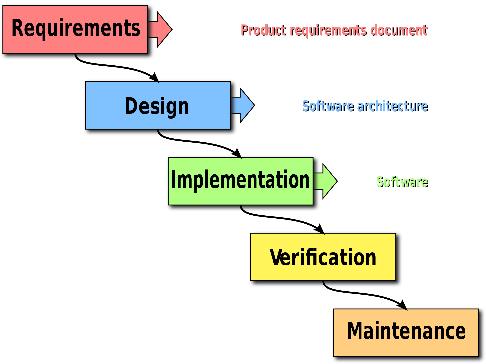
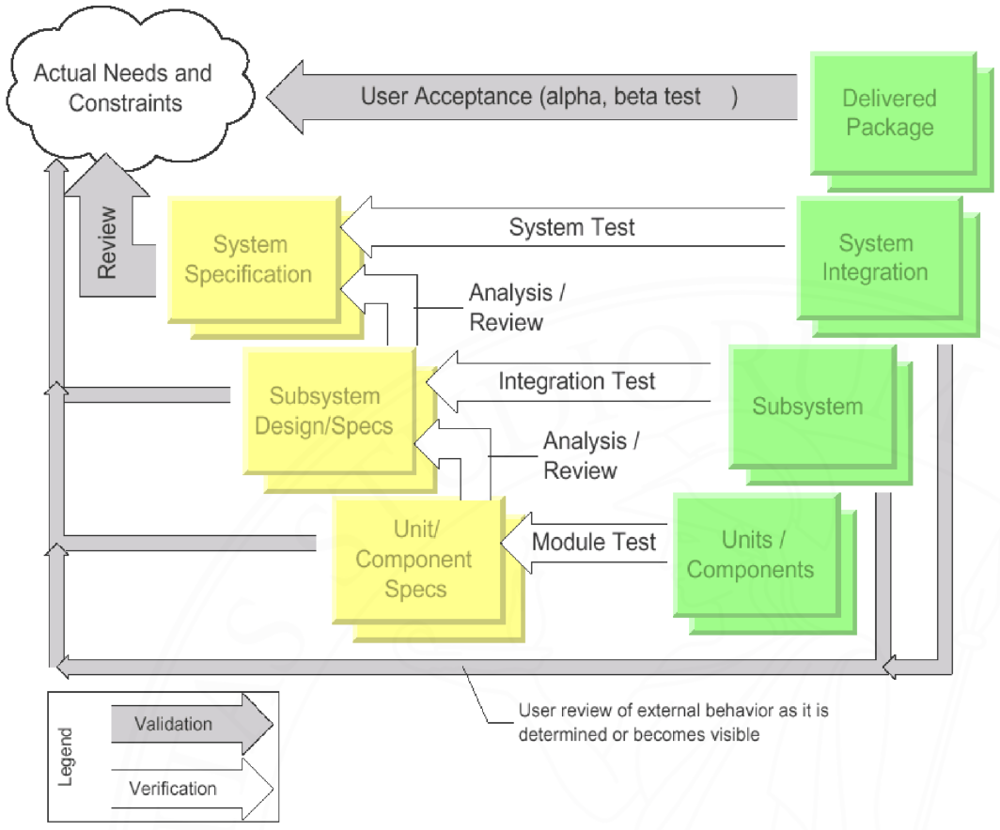
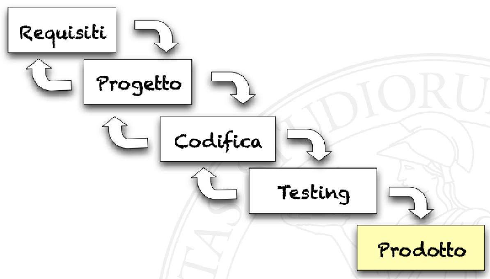
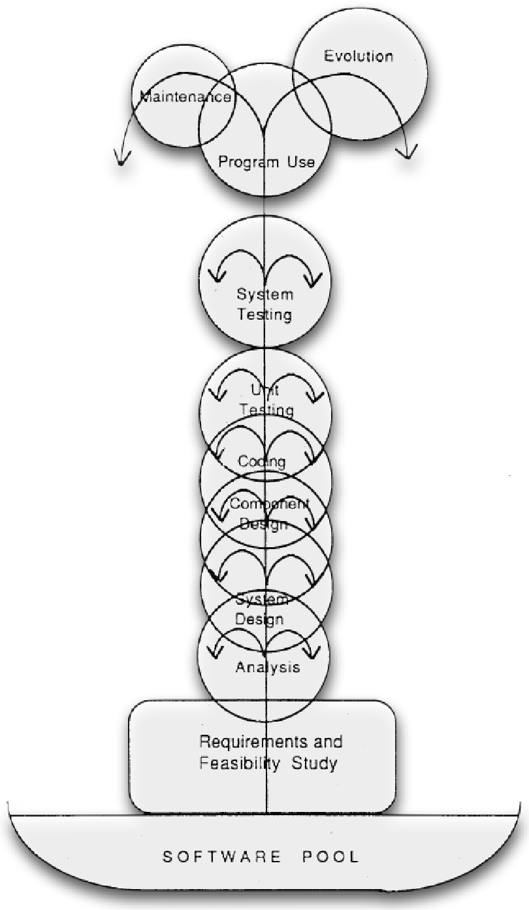
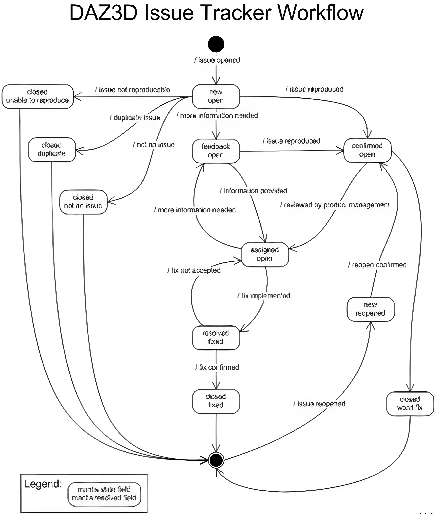
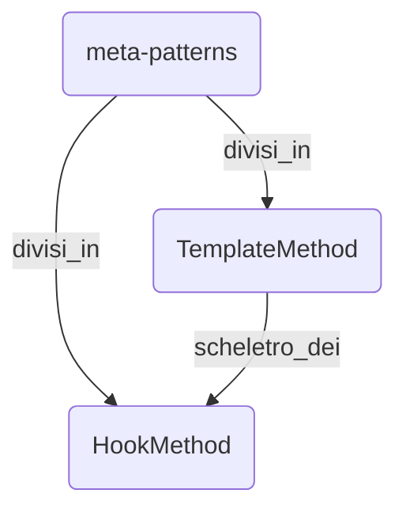
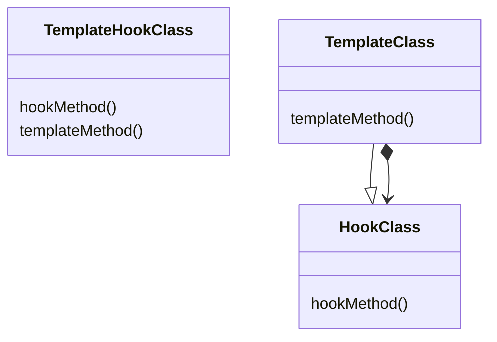
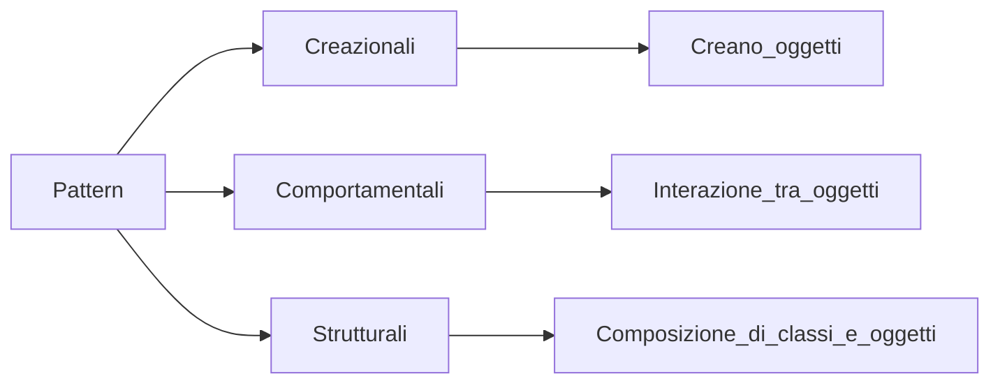
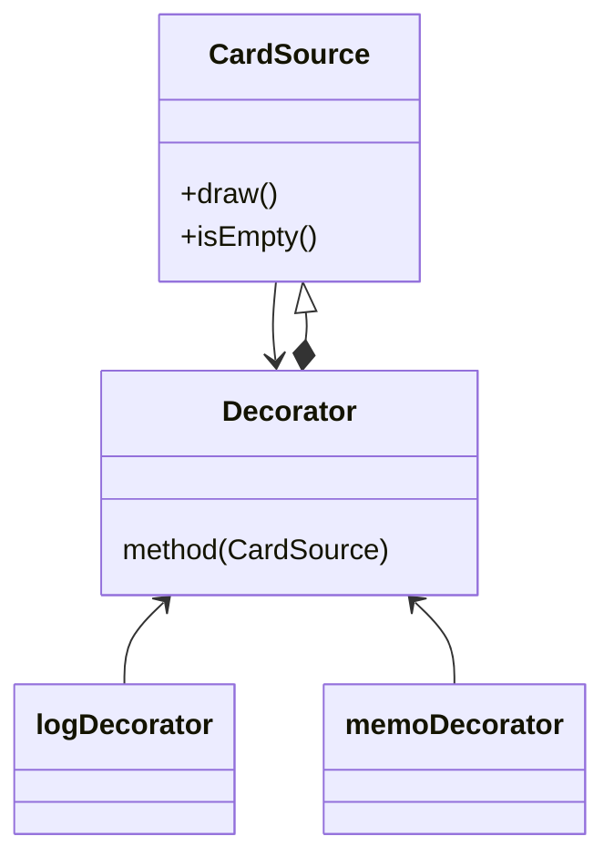

# Ingegneria del software

Il processo di produzione di un software si basa sulla comunicazione e sull’essere rigorosi, inoltre va a considerare diversi aspetti.

## Studio di fattibilità

Abbiamo varie scelte progettuali basate sullo studio degli scenari e le scelte architetturali. Lo studio di Fattibilità serve per capire anche la stima dei costi, dei tempi di sviluppo e delle risorse necessarie oltre che dei benefici delle diverse soluzioni. Possiamo farlo noi ma spesso, per non togliere persone dallo sviluppo del software, si assume uno specialista, l’output è un documento in linguaggio naturale.

## Analisi e specifica (raccolta e studio) dei requisiti

In un momento dobbiamo parlare con i clienti e capire il dominio applicativo in cui dobbiamo lavorare. Definiamo con **stakeholders** coloro che sono interessati allo sviluppo e al funzionamento dei processi. All’utente interessa solo il funzionamento, non il progetto o l’implementazione (non il **come**). Gli output possibili sono:

- documento di specifica: documento contrattuale approvato dal committente, è la base per il lavoro di design e verifica, i programmatori però preferiscono documenti più formali.
- Manuale utente.
- Piano dei test di sistema, che certificano la correttezza del software.

Non è importante scrivere ma capire.

## Progettazione

Devo scegliere l’architettura di sistema da avere come riferimento, scomporre in moduli e oggetto e identificare possibili pattern. Otteniamo così un documento di specifica del progetto.

## Programmazione e test di unità

Svolgo un testing isolato, devo quindi prima andare a creare dei test basati sul problema dato, da questi partirò scrivendo il codice che mi permetterà di risolvere il problema dato. I test saranno quindi totalmente isolati dal codice effettivo che voglio scrivere e direttamente basati sul problema, non interessa

I moduli vengono testati indipendentemente e possono essere divisi in:

- Moduli stub (fittizi)
- Moduli driver (guida)

L’output che otterremo saranno moduli sviluppati in modo separato, singolarmente verificati e con interfaccia concordata.

Successivamente avverrà l’**Integrazione** ovvero l’unione dei vari componenti, i moduli di testing vengono sostituiti ano a mano con i moduli reali.

Ho due approcci:

- Top-down:parto definendo un modulo reale che definisce l’interfaccia utente, mi illude di avere un programma completo (al di sotto sono invece presenti dei moduli fittizi).
- Bottom-up: parto da cose vere guidate dai moduli driver e fittizi, questi ovviamente non saranno visti dall’utente.

con entrambi si arriverà comunque ad ottenere un programma funzionante.

## Manutenzione

- correttiva: ho degli errori e li vado a risolvere correggendo il codice.
- Adattiva: adatto il codice a nuove leggi o specifiche.
- Perfettiva: software sufficientemente corretto ma miglioro performance, o comunque la qualità in generale del programma (refactoring) cambio quindi il codice senza modificarne la funzionalità.

### Attività finali

- Documentazione
    - Può essere un’attività trasversale
    - spesso nella pratica è un’attività a posteriori
- Verifica e controllo qualità
    - quality assurance
- Gestione del processo
    - gestione incentivi, responsabilità ed eccezioni
- Gestione configurazioni
    - relazioni inter-progettuali

### Approccio ingegneristico

1. Target: ci si prefigge un obiettivo da raggiungere
2. Metric: si definisce una metrica correlata al raggiungimento del target (non deve essere scelta a posteriori)
3. Method, process, tool: si definisce un metodo, strumento o processo che possa condurci al nostro target
4. Measurements: si confrontano le metriche stabilite nel caso di adozione o meno della tecnica sotto valutazione, valutando se sono state utili e quanto ci hanno avvicinato all’obiettivo, in base ai risultati ottenuto avremo:
    - risultati soddisfacenti ( un miglioramento della metrica) - andiamo ad accettare come buoni i metodi e processi proposti;
    - risultati insoddisfacenti (il peggioramento della metrica) -  si verificano peggioramenti o forti effetti collaterali, bisogna quindi modificare qualcosa come target o la metrica in caso ci si rendesse conto di non aver ben definito l’obiettivo, di solito bisogna però rivedere i processi e i metodi usati.

**Cosa si intende con target?** gli obiettivi da raggiungere possono essere:

1. la risoluzione dei problemi nello sviluppo del software;
2. l’assicurazione di una qualche qualità che il software dovrà avere.

### Modelli

- Modelli sequenziali
    - **Modello a cascata(lo usiamo solo come paragone negativo da non usare):** Creato come una sorta di catena di montaggio, questo modello forza una progressione lineare, impedendo di tornare indietro a uno step precedente. La maggior parte dei processi che utilizzano questo modello presentano almeno le seguenti fasi **`(separazione dei compiti)`**:“Requisiti”,”Progetto”,”Codifica”,”testing”,”Prodotto”. (Ad ogni step può essere assegnata una persona diversa in base alle sue capacità) Ogni step produce un “semilavorato” che viene poi consegnato allo step successivo. è **`Document based`** fa uso cioè di un documento per il trasferimento delle informazioni che viene creato ad ogni terminazione di fase, ciò permette a chi ha finito di lavorare nella sua fase di poter procedere ad altri lavori non essendo più necessario. La linearità inoltre permette di **`pianificare i tempi`** stimando la durata di ogni fase, questa stima è però, come la linearità, a senso unico: non possiamo ridurre il tempo speso e dovremo assorbire eventuali ritardi. Le principali criticità sono:
        - `Fase di manutenzione assente`: essendo a senso unico non possiamo tornare indietro, nonostante siamo a conoscenza che ogni software è destinato ad evolversi e cambiare; gli unici aggiornamenti possibili sono piccole patch che però disallineano solamente la documentazione precedente, è comunque la fase in cui ricadono la maggior parte dei costi di sviluppo.
        - `Rigidità`: Stima dei costi e valutazione dei rischi vengono fatti all’inizio e non quando ho capito bene il problema, resto così rigido congelando i sotto-prodotti e perdendo la flessibilità richiesta.
        - `Monoliticità`: poiché la pianificazione è orientata ad un singolo rilascio, ciò però ci porta ad un aumento dei costi e a sforare i tempi di consegna. (contraddice quindi la realizzazione di un software modificabile ed evolubile, inoltre la manutenzione viene fatta solo sul codice)
        
		
        
    - **Modello a V (dente di pesce cane):** una delle varianti del modello a cascata, introduce una più estesa fase di testing. Nonostante sia sempre un modello sequenziale presenta dei nuovi legami tra le fasi di sviluppo corrispondenti alle attività di verifica e convalida. Va ad accentuare il rapporto con il cliente, coinvolto con la richiesta di feedback per ciascun sottoprodotto generato. Le nuove attività introdotte sono definite quindi come:
        - `verifica`: va a controllare la correttezza rispetto alla descrizione formale delle specifiche;
        - `convalidazione`: controlla, attraverso un feedback continuo, la compatibilità con le esigenze del cliente.
        
        
        
- **Modelli iterativi**: ottenuto sapendo che la sequenzialità stringente delle fasi rappresenta un grosso limite, si pensa di far ripetere alcune fasi più di una volta con dei cicli fino all’ottenimento di un prodotto worth.
    - **Modello a cascata con singola retroazione:** Come il modello a cascata ma presenta una fase di testing e permette agli sviluppatori di poter ritornare al passo precedente, arrivati però al prodotto non possiamo tornare indietro per la manutenzione e l’introduzione stessa di un’iterazione renderebbe molto difficile la pianificazione del lavoro e il monitoraggio dell’avanzamento. Un’altra criticità è la possibilità di avere un problema non nel punto precedente ma direttamente all’inizio (**Condiviso da molti modelli iterativi**)
        
		
        
- **Modello prototipale:**  Si divide in pubblico e privato, lo creo per parlare con il cliente, per far vedere al cliente il funzionamento (grezzo) del software, permette di ridurre significativamente i requisiti e errori di design soprattutto riguardanti l’interfaccia utente:
    - Il `modello pubblico` viene mostrato al cliente, comporta dei rischi nella futura gestione del codice poiché può portare il cliente a richiedere nuove funzioni, ci permette di far compiere scelte all’utente; `non sto consegnando il progetto ma lo sto mostrando`;
    - Il `modello privato`, detto “spike”, è utile per testare nuove tecnologie o linguaggi e programmare soluzioni per i problemi più difficili, permettendo di comprenderlo meglio (”do it twice”) (per la legge di Bohem la prototipizzazione riduce notevolmente gli errori dei requisiti e di design, soprattutto nelle interfacce utente)

- **Modelli incrementali:** Permette di affrontare e limitare i rischi di consegna, riducendo i fallimenti,  si parla di incrementale quando nelle iterazioni viene inclusa la consegna. è più appropriato parlare infatti di `Implementazione Iterativa`, che stressa la modularizzazione e l’identificazione di sottosistemi e nel quale si ripetono fasi di coding ed integrazione, e `Sviluppo incrementale`, che viene esteso a tutte le fasi.
    
    `Caratteristiche`: 
    
    - Complicato il lavoro di planning, stato del processo meno visibile e dobbiamo pianificare tutte le iterazioni
    - Si riconosce che bisogna rimettere mano a ciò che si è fatto
    - Cosa è una iterazione, quanto dura?
        - rischio di troppe iterazioni
        - rischio di overhead causato dalle troppe iterazioni
        - rischio di eccessivo overlapping
            - non abbiamo tempo di avere feedback dall’utente.
    
    - **Modello a fontana**: nel modello a fontana, in caso di problemi si riparte dal primo passaggio (ovvero la definizione dei requisiti)  senza però andare ad eliminare il lavoro svolto. Cerco infatti il punto più “indietro” che viene influenzato dal problema, così da poterlo correggere, in questo modello non congeliamo il prodotto in uso (che può provocare problemi) ma lo lascio lavorare permettendomi di arrivare ad una eventuale manutenzione o evoluzione dello stesso.
	
	
	
    - **modello a flipper**: è un processo non definito, può essere svolto qualunque passo, è un modello creato come critica ai modelli incrementali, i vari punti in cui rimbalza la pallina rappresentano una fase, non ho quindi il controllo del mio progetto.
    
    
- **Modelli trasformazionali**: cercano di mantenere sotto controllo tutti i passi e i procedimenti in modo formale; partendo da specifiche spiegate in modo informale (dal cliente) otteniamo come risultato un prototipo (diverso dal concetto di prototipo precedentemente definito) che differisce per efficienza e completezza dal prodotto finale, inoltre tali passi devono essere dimostrabili formalmente come corretti. In caso il passo non fosse corretto, ovvero nel caso arrivassi ad un vicolo cieco, posso tornare un passo indietro scegliendo una nuova strada (viene utilizzato soprattutto per progetti molto piccoli con caratteristiche molto rigide); le prove di correttezza utilizzate possono essere riutilizzate che vengono mantenute in un repo apposito.
	
    - **MetaModello a spirale**: non è propriamente un modello bensì un framework/pattern in cui possono essere inquadrati altri modelli. è di tipo incrementale ed è guidato da un’analisi dei rischi (diminuisce il costo? è fattibile in questo quantitativo di tempo?) ovvero su cosa possiamo fare in caso di un certo rischio. Si dice a spirale poiché (*aggiungere immagine*) caratterizzata da quattro fasi principali: 1. Determinare gli obiettivi 2. identificare e risolvere i rischi 3. Sviluppo e testing 4. pianificazione dell'iterazione. Il raggio della spirale indica il costo cumulativo del progetto.
	    
		
        - **Variante Win-WIn**: questa variante prende in considerazione anche i rischi contrattuali che possono esserci con i clienti, problemi quindi di comunicazione che necessitano di contrattazioni e negoziazione. Entrambe le parti, quindi, vincono attraverso questa variante.
        
	    
    - **Modello COTS (Component Off The Shelf)**: (*ci sono per caso funzionalità/componenti già presenti? magari utilizzati in progetti vecchi o in progetti di altre persone/aziende*) si parte dalla disponibilità interna o sul mercato di moduli pre-esistenti, non riusciremo a creare un progetto formato solo da moduli preesistenti ma ciò ci permette di di non dover partire *pefforza* da zero. Dobbiamo però basarci su altre attività (vedi appunti corso). Anche la prontezza della risposta rispetto ad alcuni problemi va a favore o contro all'adozione di tali componenti.
    

- Metodi agili: (Ci si concentra sull’extreme programming, nascono dagli sviluppatori stessi)
	Utilizzano il manifesto dei metodi agili che indica i componenti fondanti dell'XP:
	- Individuals and interactions
	- Working software
	- Customer collaboration
	- Responding to change
	Unico problema di questo metodo è la mancanza di persone oggettive.
	
	I requisiti diventano volatili, possiamo gestirlo, infatti il cliente può cambiare sempre idea
    
    - ***Modello Lean Waste*:** nata dalla lean manufactoring di Toyota. Si basa sulla riduzione di spazzatura e di cose inutili, rimandiamo una scelta che ci vincola in modo da ridurre eventuali sprechi. (in programmazione può anche essere una feature che creiamo ma che non è alla fine dei conti utile per il cliente ma solo per noi)
    
    - ***Modello Kanban*:** basato su una lavagna con diverse colonne: “to-do”, “in progress”,” testing” e “done” nelle quali andiamo ad inserire le varie parti del progetto, in done metteremo ciò che è stato completato, che ha passato i test e che è stato valutato e accettato dal cliente. Per Kanban noi dobbiamo andare a minimizzare il “work in progress” e le distrazioni in modo da massimizzare il lavoro.
    
    - ***Scrum*:** Approccio simile al *win-win*, il cliente può aggiungere o togliere delle richieste ma dopo una certa scadenza (due settimane) sposto ciò che è stato richiesto nella seconda colonna dove rimane congelata, ciò vuol dire che il cliente non potrà richiederne la modifica prima della scadenza pattuita per il nuovo incontro.
    
    - ***Crystal*:** Si basa sulla *comunicazione osmotica* la conoscenza cioè viene sparsa a tutto il team, ovvero viene condiviso ciò su cui si ha lavorato per evitare eventuali “blocchi” del lavoro causati da imprevisti verso uno o più elementi del gruppo.

## eXtreme Programming (XP)

Si basa sul TDD (test driven development), vado cioè a creare prima un test che possa verificare la correttezza dell’idea, dopo aver creato il test da cui partire evolveremo per baby-steps, ovvero tramite piccole porzioni, andando a testare questi e ad ottenere così un feedback istantaneo. Vado quindi a cercare la semplicità e la velocità.

### TDD
Mantra del ***TDD*** è (`Rosso, Verde, Refactoring`):

- write a failing test (che compili e dia errore)
- make it pass
- refactor (modifiche che faccio per migliorare le prestazioni generali del codice senza modificarne il risultato)

Variabili in gioco nell'XP:

- **Portata**: ovvero la quantità di funzionalità che si vogliono implementare, di cose che devono essere fatte;
- **Tempo**: ovvero il tempo che ho a disposizione per terminare il progetto;
- **Qualità**: ovvero la qualità del progetto che si deve ottenere;
- **Costo**: Le risorse finanziarie che si possono impegnare nel progetto, dipende dal tempo (maggiore sarà il tempo dedicato al progetto, maggiore sarà il costo);

Principi:

| XP                                                                   | Ing SW “classica”             |
| -------------------------------------------------------------------- | ----------------------------- |
| Feedback rapido (in caso di dubbi devo poter chiedere subito)        | Separazione degli interessi   |
| presumere la semplicità (progetto solo per ciò che mi è stato detto) | Astrazione e modularità       |
| Accettare il cambiamento                                             | anticipazione del cambiamento |
| Modifica incrementale                                                | generalità                    |
| Lavoro di qualità                                                    | incrementalità                |

Grazie all'extreme programming il costo di nuove modifiche sarà si alto inizialmente, ma tenderà a stabilizzarsi con l'aumentare della quantità di tempo impiegato sul progetto, questo poiché il tempo verrà usato soprattutto su operazioni di refactoring che permetteranno di mantenere la semplicità e la pulizia del codice e facilitando future implementazioni.
Ciò è diverso dalla correzione di errori che ovviamente aumenterà le tempistiche del progetto (Ci vuole coraggio per fare il refactoring poiché andiamo a toccare una parte di codice che funziona).

---
# Lezione 4
## Figure in gioco e responsabilità 

Il manager/cliente ha la responsabilità di decidere portata, priorità tra funzioni e date dei rilasci mentre ha il diritto di sapere cosa può essere fatto, di vedere i progressi nel sistema e di cambiare idea.

Lo sviluppatore deve stimare i tempi per le singole funzionalità, le conseguenze delle scelte tecnologiche e una pianificazione dettagliata, ha il diritto di sapere cosa è necessario attraverso requisiti chiari; ha il diritto di cambiare le stime dei tempi in base all'esperienza acquisita e di produrre un software di qualità. Deve inoltre identificare eventuali funzionalità pericolose per il successo del progetto (se una funzione viene messa in secondo piano dal cliente ma si rivela essere il punto fondante del progetto stesso.) 
Tra gli sviluppatori è presente un `Tracker`, figura alternata tra i componenti del team di sviluppo che va a misurare velocità, quantità di bug trovati ed altri elementi che possano permettere di avere una visione completa riguardo all'avanzamento dell'iterazione (ovvero dello sviluppo) consentendo al team di rimanere sempre aggiornato.

1. **Planning Game**:
	in questa fase vengono determinate le funzionalità  del rilascio successivo, andando a combinare valutazioni tecniche (tempistiche e capacità degli sviluppatori) insieme alle priorità commerciali. Per questo planning game il cliente utilizzerà delle carte dove saranno presenti frase di descrizione, scenario d'uso e test di accettazione successivamente gli sviluppatori faranno una stima dei tempi e dei costi per implementare tali feature. Attraverso queste info il `manager` deciderà quali implementare e quali no in base ad alcuni vincoli (i tempi non devono superare 400 ore mentre devo massimizzare il valore ).
	**`Come faccio le stime?`** da un lato è buono fare una stima a gruppi dall'altro in extreme programming dobbiamo avere il consenso per tutti quelli del team.
	- stime molto differenti: si cerca di trovare un accordo nel team
	- Stime simili ma molto alte: si parla con il cliente per poter suddividere la feature in parti minori
	- nessun accordo tra le stime ma sono simili: devo trovare una `stima condivisa` che non sia pessimista
	**Stime condivise:**
	- Il primo problema è la perdita di tempo per la troppa comunicazione
	- Effetto ancora:
		l'ancora è un valore che va ad influenzare le altre persone nella stima
	**Stime agili: Planning poker**
		Vengono presentate le carte, i developer possono quindi fare domande e chiarire assunzioni e rischi con i clienti.
		Date tutte le carte queste vengono scelte e girate contemporaneamente, così che la probabilità di avere un'ancora sia molto bassa, successivamente si esprimono le proprie stime e chi ha dato quelle più basse o più alte spiegano le loro motivazioni; si ripete ciò fin quando non arriviamo ad un accordo unanime.
	**Team Estimation Game:**
	1.  **Prima fase:**
		Si fa una pila con le "storie" e il primo developer sceglie dove mettere la carta sinistra (facile) destra (difficile) o sotto (equivalente), quello successivo sposta una carta già presente o ne sceglie un'altra e così via
	2. **Seconda fase:**
		Ci si rimette in coda davanti al tavolo e si ha un mazzo di carte tipo quello del planning poker, la prima carta si mette sulla prima colonna(prima carta è di solito di valore 2), il primo developer prende la prima carta e la posiziona sulla colonna del valore che pensa possa avere. Il developer successivo, come nella prima fase, prende un'altra carta o sposta quelle già messe altrimenti (se non ci sono carte) passa.
	3. **Terza fase:**
		Si va a stimare il tempo (ore/uomo) di una delle carte più semplici (di valore 2) e le altre stime saranno calcolate proporzionalmente.
		**Velocity**: capacità del team di completare certi lavori, va a sostituire la necessità di ri-mappare unità ideali in tempi assoluti, dopo aver completato la prima iterazione il team dirà di poter sviluppare tanti punti quanti erano quelli fatti nell'iterazione precedente.
2. **Brevi cicli di rilascio**
	Rilascio diverse versioni del software in modo da diminuire eventuali rischi e problemi che possiamo avere in corso d'opera, devono comunque essere rilasci significativi decisi dal manager.


		>[!Attenzione] 
		>- Non è un metro di valutazione del team
		>- Non si devono considerare storie non finite
		>- Non deve essere imposta
3. **Uso di metafora (poco usato)**
	Trovo un elemento diverso sul quale mappare i vari elementi del programma 
4. **Semplicità di progetto**
	Massimizzare il lavoro non fatto (se ho un pezzo di codice che uso più volte non andrò a copiarlo e incollarlo ma creerò una funzione, così da dover cambiare il codice una sola volta)
5. **Testing**
	Dobbiamo ideare i test prima di scrivere il codice, scrivendo dei test abbiamo la sicurezza che il codice funzioni; ciò può essere utile anche per programmatori che non hanno mai visto quella parte di codice.
6. **Refactoring**
	Fatto per `Incremento` e `Semplificazione` 
7. **Programmazione a coppie**
	Aiuta nella maggior parte del lavoro, dal controllo continuo del rispetto delle regole XP al refactoring, diminuisce in caso la quantità di codice prodotto ma aumenta la quantità concedendo quindi un aumento del guadagno.
8. **Proprietà collettiva**
	La responsabilità di ogni cambiamento non è della singola persona ma dell'intero team, dobbiamo sentirci responsabilizzati sull'intero codice anche se non conosciamo tutto alla stessa maniera.
9. **Integrazione continua**
	Bisogna avere una veloce frequenza di integrazione e aggiornamento, quando viene risolto un problema bisogna risolvere anche i problemi di integrazione
10. **Settimana di 40 ore**
	Con un quantitativo di ore di lavoro non eccessivo i programmatori lavorano meglio grazie ad un buon rapporto vita/lavoro.
11. **Cliente sul posto**
	Permette una fase di specifica leggera e fornisce informazioni in tempo reale riguardo nuove funzioni o plug in.
12. **Standard di codifica**
	Uno standard deciso tra i componenti del team per aiutare nella comprensione del codice, semplificando refactoring, lavoro a coppie e proprietà collettiva.
13. **Just loose (?)(non piace al bellettini)**
	Le regole sopra citate sono solo di riferimento non universali, possiamo considerarle tutte, solo alcune o nessuna. (non farlo all'esame).


---
# Lezione_5
## Raggruppare per fasi

- Requirements:
    - Gli utenti fanno parte del team di sviluppo
    - Consegne incrementali e pianificazioni continue, non posso quindi raccogliere tutto insieme ma in modo continuo e incrementale
- Design:
    - metafora come visione unificante del progetto;
    - Refactoring, ripensare quindi a come cambiare il design
    - presume la semplicità
- **Code**:
    - *programmazione a coppie*;
    - *proprietà collettiva*;
    - *integrazione continua*;
    - *standard di codifica*.
- **Test**
    - *test di unità* continuo (da scriversi prima del codice);
    - *test funzionale* scritto dagli utenti nelle user stories

## Documentazione

Bisogna cercare di scrivere codice che non abbia bisogno di commenti.
è qualcosa di volatile che può portare a un disallineamento, la fonte principale di documentazione deve quindi essere il codice stesso, scritto in modo leggibile grazie agli standard di codifica, ma soprattutto dai test.
## Quando non possiamo usare xp?

In ambienti che impediscono l’uso di anche un solo approccio utilizzato,

- Barriere tecnologiche che impediscono di testare il sistema in condizioni reali e di avere feedback in modo rapido;
- Barriere di tipo manageriale o burocratico, quindi team troppo numerosi e la necessità di documentazioni per certificazioni basate su di essa.
- barriere di tipo fisico, ovvero che non permettono flessibilità nella formazione delle coppie di lavoro

## Mesi-uomo

Il rapporto tra numero di persone che lavorano e tempo si pensa essere proporzionale, ovvero all’aumento del numero di persone diminuisce il tempo che esse devono impiegare per programmare i loro pezzo di codice, ovviamente ciò è sbagliato a causa dell’**overhead** che va ad impedire una corretta comunicazione impattando la gestione dei ritardi.

## Open Source
- Cattedrale e il Bazaar
	Prende come punto di partenza la frenesia di uno sviluppatore pronto a programmare, egli chiede ad amici o colleghi, trovando qualcuno con problemi simili o lo stesso problema ma non trovano soluzioni, si ha quindi uno scambio di pareri tra le persone interessate e quelle che intendono spendere risorse (ovvero tempo) in questo progetto danno il via ad un prototipo informale. Ciò porta ad ottenere una prima versione del software che, dopo essere stato presentato, permetterà di ottenere informazioni e consigli da persone esterne.
	
	
- Care and feeding of FOSS
	1. Invention: Qualcuno presenta un'idea e la si fa lavorare
	2. Expansion and Innovation: il mondo se ne accorge e la tecnologia inizia a prendere piede.
	3. Consolidation: Alcuni progetti diventano dominanti mentre gli altri vengono assorbiti al loro.
	4. Maturity: mercato ridotto a pochi prodotti dominanti, difficile per nuove aziende dello stesso tipo di entrare nel mercato
	5. FOSS Domination: con il rallentamento dell'innovazione la community FOSS va a erodere la leadership detenuta dalle soluzioni commerciali.
	6. The FOSS era: Le versioni FOSS dominano su quelle a pagamento.
	
	
- Emerging Economic Paradigm of Open Source:
	Tutto ciò che mi permette di diminuire i costi è "buono".
	Distinguiamo due tipi di tecnologie ovvero quella `Differenziante`, che mi da un vantaggio competitivo, e quella `Non differenziante`.
	
	
Nel mondo Open Source vari problemi diventano enormi:
- modello a cascata: fase a se stante, dopo aver sviluppato tutti i componenti li compiliamo insieme
- modello microsoft: alla fine di ogni giornata, ogni sviluppatore che ha scritto un certo numero di linee di codice, doveva garantire che quel codice poteva essere ricompilato a tutto il resto con obiettivo di sincronizzare e stabilizzare il tutto, chi causava il fallimento della compilazione veniva linciato (joke ma non del tutto).
- modello XP: più volte al giorno escludendosi a vicenda
- FLOSS: Continuamente e senza coordinazione e controllo, ciò può portare ad avere un prodotto totalmente diverso da un giorno all'altro.

Come facciamo con la comunicazione? Attraverso strumenti specifici di supporto

---
# Lezione_6
## Strumenti di supporto

Vanno dalla comunicazione: quindi internet o forum, alla sincronizzazione del lavoro e versioning fino all’automazione della build e al bug tracking.

## Source Code Management (SCM): scenari

- Gestisce il luogo in cui vengono messi i progetti in fase di evoluzione, permettendo di andare a cercare e risolvere eventuali errori gravi, richiamando e mettendo in confronto versioni diverse

## Cosa tracciare?

Dobbiamo prima di tutto rispondere alle domande:

- Si traccia l’evoluzione anche di componenti fuori dal nostro controllo?
- Si archiviano i file che costituiscono il prodotto?

E la risposta è no, poiché risulta costoso sia in tempo che in spazio e risulta anche poco pratico.

### Meccanismo di base

ogni cambiamento è regolato da:

- check-out, ottenere una versione già presente
- check-in(commit), registrare nuova versione

La repo mantiene informazioni comprese date, etichette versioni e diramazioni, può salvare solo le differenze tra una versione e l’altra.

Quando è condiviso da un gruppo di lavoro nasce il problema di gestirne l’accesso concorrente:

- modello “pessimistico” (RCS): la gestione degli accessi agli artifact viene fatta in mutua esclusione, attivando un lock (la durata deve essere piccola) al check-out. (previene)
- Modello “ottimistico” (CVS): il sistema si disinteressa del problema, andando a fornire supporto per le attività di merge di change-set paralleli in conflitto (sistema), questo modello è parzialmente regolabile tramite branch, le varie diramazioni vengono unite (merge) andando a confrontare le differenze.

## SCM distribuito

I vantaggi di sfruttare i sistemi Software Configuration Management sono differenti:

- posso lavorare offline, facendo commit senza rete, posso poi aggiornare il repo appena avrò una connessione.
- Lavoro veloce, non rallentato dai tempi del commit grazie alla presenza di un repo locale.
- Supporta diversi modi di lavorare:
    - simil centralizzato: si considera un repository come riferimento
    - i peer che collaborano direttamente
    - gerarchico a più livelli

Quando un oggetto viene salvato, si calcola l’hash dello stesso oggetto che viene salvato insieme ad esso.

I tipi di oggetti possono essere:

- Blob, una massa informe di dati  (file compresso).
- Tree, blocco che indica una directory
- commit, contiene le meta informazioni di quel blob

posso usare git commit —amend per  sostituire l’ultimo commit effettuato, quello vecchio viene eliminato dal garbage collector.

Spesso facendo git merge possono verificarsi dei conflitti quando la stessa zona di codice (chunks) viene modificata da più utenti, o abbiamo dei merge con codici uguali o quando sono tutti e tre diversi.

git reset che parte dal local repo, aggiorna e sovrascrive gli index con quello che c’è nel commit più recente

## Branch

Creare dei branch è praticamente obbligatorio, quando cloniamo siamo già in presenza di due branch: Main e remote main.

```code
git branch -b nome_branch
```

La prima branch non vale come main effettivo, infatti il vero e proprio “main” sarà quello su cui verrà eseguito il primo commit; i branch si usano soprattutto in un workflow molto grande.

## Gitflow

Inizializzo con `git flow init`.

Differenzia i vari rami dando loro, in base alla diversa categoria, comandi differenti.

I rami principali sono `Master`e`Develop`, il primo contiene le versioni stabili, develop invece è il ramo di integrazione, nel quale il codice viene modificato prima del rilascio di una versione stabile.

Altri rami sono:

- `Feature` : un ramo non infinito, viene creato per ogni funzionalità nuova che voglio sviluppare, quando penso di aver terminato lo sviluppo di tale feature mi sposto nel ramo develop. La feature deve partire dall’ultima versione stabile che è partita dal develop. Non posso aprire feature con lo stesso nome.
    
    Il comando `git flow feature start <nome_feature>` corrisponde a:
    
    ```java
    git checkout develop
    git branch <feature>
    git checkout <feature>
    ```
    
    Il comando `git flow feature finish <nome_feature>` corrisponde a:
    
    ```java
    git checkout develop
    git merge --no-ff feat1 (--no-ff vuol dire "ti obbligo a fare il merge anche in caso di fast forward(avviene in mancanza di altri commit)")
    git branch -d feat1
    ```
    
- `Release`: Congelo le feature che dovranno esserci nella prossima release, quando faccio una release (beta) vado a riparare, chiedendo ai beta tester dei feedback.
    
    Avvio utilizzando `git flow release start ver`che corrisponde a
    
    ```java
    git checkout -b ver develop
    ```
    
    mentre termino con `git flow release finish ver`:
    
    ```java
    git checkout master
    git merge --no-ff release-ver
    git tag -a ver
    git checkout develop
    git merge --no-ff release-ver
    git branch -d release-ver
    ```
    
- `Hotfix`: creato in caso di problemi importanti (crash o grandi problemi di sicurezza).
    
    Si apre con `git flow hotfix start ver`:
    
    ```java
    git checkout -b ver master
    ```
    
    si chiude con `git flow hotfix finish ver`:
    
    ```java
    git checkout master
    git merge --no-ff ver
    git tag -a ver
    git checkout develop
    git merge --no-ff ver
    git branch -d ver
    ```
    
- `Support`: aperto quando devo fixare dei bug in una versione vecchia del software senza andare ad intaccare la nuova versione (ad esempio viene presentato un bug della versione 1.1 ma siamo già alla v2.0).
    

### Git request-pull

### Fork

Va a risolvere il problema delle autorizzazioni

## Gerrit

Progettato da google, è un sistema di review del codice sviluppato internamente a google utilizzato per la gestione di progetti open source troppo grandi come android.

### Verifier: Verifying a chance

Uno strumento o processo utilizzato in Gerrit per verificare che le modifiche proposte siano corrette e funzionino come dovrebbero.

### Approver

Successivamente alla verifica di una proposta di modifica questa deve essere anche approvata

### Build automation

Per proteggersi da checkin di una versione non funzionante possiamo automatizzare la ricompilazione e il testing

### Make
- Composto da comandi di shell.

### Ant

### Gradle
pensato per la definizione di scripting, utilizzato per builds multi progetto, va a definire un linguaggio specifico per le dipendenze.

### Plugin

---
## Interfaccia e polimorfismo

# Lezione_8
## Bug tracking

Tengono traccia e gestiscono tutte le segnalazioni  sui difetti di un software.
Hanno centralizzato le segnalazioni in modo tale da impedire il moltiplicarsi delle stesse. 
Il bug tracking era molto difficile sopratutto considerando il modello a cascata (poiché privo di backtracking).
Il concetto principale dei bug tracker è appunto la segnalazione o comunque la comunicazione tra vari developer riguardo possibili bug.

### Bug workflow e ciclo di vita (simile a FSM)

  


### Unified Process

### Best practice

- Sviluppare iterativamente
- Gestire i requisiti
- Usare a


## Progettazione

### Refactoring
Come già detto quando andiamo a fare il refactoring del codice non dobbiamo modificare il funzionamento delle feature presenti (fase invisibile al cliente) e inoltre non possiamo aggiungere dei test rispetto alla fase verde appena raggiunta.

### Design Knowledge
Dove la salviamo? 
0. in memoria
1. nei documenti di design (scritti in linguaggio naturale)
2. le piattaforme di discussione
3. UML
4. nel codice stesso

### Come condividiamo
0. metodi
1. design pattern
2. principi, a cui punteremo molto nel corso.

### Reference Escaping (trucco napoletano)
violazione dell'incapsulation, porta alla bocciatura diretta (kek)


### Immutabilità

# Lezione_9

### Interface segregation
### Collegamento dinamico ed extensibility
Permette di chiamare codice non ancora scritto, così facendo non serve modificare il codice per permettergli di richiamare metodi di una nuova classe (da qui extensibility)

### Esempio di diagramma delle classi UML
tutti gli elementi presenti all'interno dell'interfaccia devono essere astratti.
- classi
	- attributi
	- metodi
- relazioni:
	- Generalizzazione e implementazione
	- associazione,aggregazione e composizione
	- dipendenze

## Pattern
è un design pattern, una soluzione di progettazione di una situazione ricorrente.

### Antipattern


### Idiomi
Come un pattern ma non indipendente dal linguaggio

### Metapattern
Sono situazioni comuni che posso ritrovare nei pattern:
Identifica due metodi:
- **HookMethod**: determina il comportamento specifico nelle sottoclassi, il _punto caldo_ in cui posso intervenire per personalizzare e/o adattare lo schema;
- **TemplateMethod**: mette insieme diversi punti caldi (scheletro), è l'_elemento freddo_ ovvero quello che non varia;


_`Come si relazionano?`_

- **Unification**: si trovano nella stessa classe del framework
- **Connection**: quando sono in classi separate che vengono collegate tramite una associazione; la classe hook(astratta) viene chiamata come istanza nella classe template.
- **Recursive Connection**: sono in classi tra loro collegate anche tramite relazione di gerarchizzazione: classe template è una hook class.



Abbiamo tre categorie principali di pattern:
- **Creazionali**: risolvono problemi attraverso la creazione di oggetti
- **Comportamentali**: problemi di dinamicità dell'interazione tra oggetti
- **Strutturali**: problemi riguardanti la struttura statica delle classi/oggetti.



### Singleton Pattern
Utilizzano solo oggetti e non classi cercando di rendere la classe responsabile del fatto che non può esistere più di una istanza.
è Teoricamente giusto

```java
public class Singleton {
/* costruttore privato o comunque non pubblico*/
protected Singleton(){...}

/* salvo l'istanza per usarla dopo*/
private static Singleton instance = null;

/*metodo statico*/
public static Singleton getInstance(){
if(instance == null) {
instance = new Singleton();
}
return instance;
}

public void metodoIstanza(){...}
}
```
Utilizzo Double Check per poter evitare che si creino più copie dell'istanza (per via di processi concorrenti) e mantenendo alte le prestazioni che calerebbero con il solo utilizzo di `@Synchronized`.

```java
public class Singleton {
/* costruttore privato o comunque non pubblico*/
protected Singleton(){...}

/* salvo l'istanza per usarla dopo*/
private static Singleton instance = null;

/*metodo statico*/
public static Singleton getInstance(){
if(instance == null) {
	synchronized(Singleton.class){
	if (instance == null)
		instance= new Singleton();
	}
}
return instance;
}

public void metodoIstanza(){...}
}
```
#### Singleton Java Idiom
Gli idiomi vengono creati in modo differente per ogni linguaggio, in java utilizziamo `enum`, un enumerativo che ha come unico valore l'istanza; ciò permette (come nei singleton) di andare a creare una sola istanza  a cui dovranno accedere tutti. è inoltre thread safe, poiché la concorrenza viene gestita internamente da java.
è definito Idioma poiché soluzione dipendente da uno specifico linguaggio.
Il Singleton deve però essere usato con cautela poiché viola alcuni dei principi `SOLID` e può essere sostituito da altri elementi in base alla circostanza.

### Iterator pattern
Permette di accedere agli elementi di un oggetto aggregatore in maniera sequenziale senza dover esporre la rappresentazione interna.


# Lezione_10

### Nullability
Il valore `null` può essere assegnato ad una variabile che indica un riferimento ad un oggetto.
Troviamo un problema quando proviamo a dereferenziare a variabile e non puntando nulla otteniamo un NullPointerException.

>[!Warning]
>Meglio non mettere nel codice dell'esame null visibili (come nell'interfaccia)

Come sappiamo non dobbiamo usare commenti come ```//should never be null```

#### Approccio fail-fast
un approccio utilizzabile è il `fail-fast`, andiamo cioè ad inserire un controllo diretto (senza utilizzare if (valore !=null)) attraverso l'aggiunta di ```java Object.requireNonNull(valore)``` 

#### Programmazione difensiva
Andiamo a fare il throw di una exception ```if (valore === null || valore2=== null)throw IllegalArgumentException```

#### Utilizzo @NotNull
Questo elemento, utilizzato quando andiamo a creare una nuova variabile o all'interno dei parametri va a restituire un warning per (ma non blocca) i valori null immessi illegalmente, inoltre va a propagarsi nelle variabili figlie/padri

## NullObject pattern

Utilizzo il singleton.

```java
	public interface CardSource {
	card draw();
	boolean isEmpty();
	
	
	enum NULL implements CardSource {
	INSTANCE;
		public boolean isEmpty(){return true;}
		public Card draw(){
			assert !isEmpty();
			return null;
		}
	}
	}
```

##### Esempio di uso di NullObject
```java
Card draw(){
if(isEmpty())
	return null;
else
	return internal.remov
}
```


## Mocking
`Test Double` 
Il doppione (non intende doppia precisione).
Il doppione viene creato quando necessitiamo di un sostituto del DOC -> dependent on component che:
- è ancora in fase di sviluppo
- fornisce dati non deterministici o prevedibili
- può presentare situazioni non facilmente riproducibili (tipo errori di trasmissione o esaurimento di memoria)
- la funzione è lenta
-  o semplicemente se si vuole testare il SUT -> System under test senza correre il rischio che il DOC introduca errori.

- ##### Dummy objects
	Sono oggetti passati in giro ma mai veramente usati quando:
	- non posso passare null
	- potrei avere solo una interfaccia e non una classe
	- potrei avere solo costruttori complessi
	Non mi interessano tutti i valori dati a questo oggetto, ne creo quindi uno fittizio.
- ##### Stub Objects
	Oggetti che forniscono delle risposte preconfezionate alle sole chiamate fatte durante il testing
- ##### Spy Objects
	Si prende un oggetto esistente e lo si circonda, wrappandolo, con oggetti che ne permettano l'utilizzo come mock
- ##### Fake objects
	Non potrò mai usarli in produzione (esempio database), utili quando sfrutto per poco tempo le capacità del codice, non sono da costruire ma sono già presenti.
	Inefficiente per casi troppo grandi.

### Mockito
Esempi: (da mettere)

#### Stubbing
```java
when(mockedObj).methodname(args).thenXXX(values);
```
```java
doXXX(values).when(mockedObj).methodname(args)
//funziona con metodi che ritornano void
```

#### Chain of responsibility
Mi permette di togliere da una classe una certa responsabilità, devo avere la possibilità
Nel chain of responsibility il cliente conosce solo la cima della catena non il resto.

```java
public @NotNull PokerHand.HandRank handEvaluator(@NotNull PokerHand pokerHand) {
if (isATris(pokerHand))
	return PokerHand.HandRank.THREE_OF_A_KIND;
return next.handEvaluator(pokerHand);
}
```

# Lezione_11
## Duck_saga
#### Pattern strategy
Abbiamo una famiglia di algoritmi/funzioni, il pattern li rende quindi intercambiabili tra loro tramite encapsulation (posso usare o uno o l'altro)
### Adapter Pattern

#### Class adapter

#### Object adapter

## Facade pattern
fornisce un'interfaccia unificata e semplificata a un insieme di interfacce separate
#### Composite Pattern
Gestisce strutture ad albero per rappresentare gerarchie di parti e insieme uniformemente
Pattern nati durante la creazione di GUI

#### Decorator Pattern
aggiungere nuove funzionalità o caratteristiche dinamicamente 
##### Card decorator(esempio)
Possiamo considerare decorator un draw che printa le carte pescate.

# Lezione_13
(nella lezione 12 sono stati fatte correzioni del laboratorio precedente)

### Soluzioni semplici da evitare
1. Non è giusto creare una classe per ogni possibile combinazione di decorazioni
2. Antipattern God class, creare un boolean per fare il check di ogni possibile classe


Utilizziamo Decorator come classe astratta perché ci permette di usare un unico pezzo di codice per differenti lavori. La fattorizzazione aggiunge leggibilità, evitandoci problemi quando questo codice da errore.

- **Versione_1**:
	```java
	public abstract class Decorator implements CardSource{
		private final CardSource element;
		
		public Decorator(CardSource cardSource) {
			assert element != null;
			this.element = element;
		}
		
		@Override
		public Card draw(){
			return element.draw(); // non voglio cambiare draw();
		}
		
		@Override
		public boolean isEmpty() {
			return element.isEmpty();
		}
	
	}
	```
	aggiungo poi le classi che estendono il decorator

- **Versione_2**:
	creo classi separatamente, vedo se hanno qualcosa in comune, fattorizzo e vedo se c'è altro in comune.
	```java
	public abstract class Decorator implements CardSource{
		private final CardSource element;
		
		public Decorator(CardSource cardSource) {
			assert element != null;
			this.element = element;
		}
		
		@Override
		public Card draw(){
			Card card = element.draw()
			decorationAction(card);
			return card;
		}
		
		@Override
		public boolean isEmpty() {
			return element.isEmpty();
		}
		
		protected void decorationAction(@NotNull Card card){}
	}
```

Per risolvere i problemi di stato presenti in queste versioni possiamo andarlo ad estrarre lo stato nella parte comune

## Observer_Pattern

### Observer: Push
### Observer: Pull
(da vedere sugli appunti pronti)